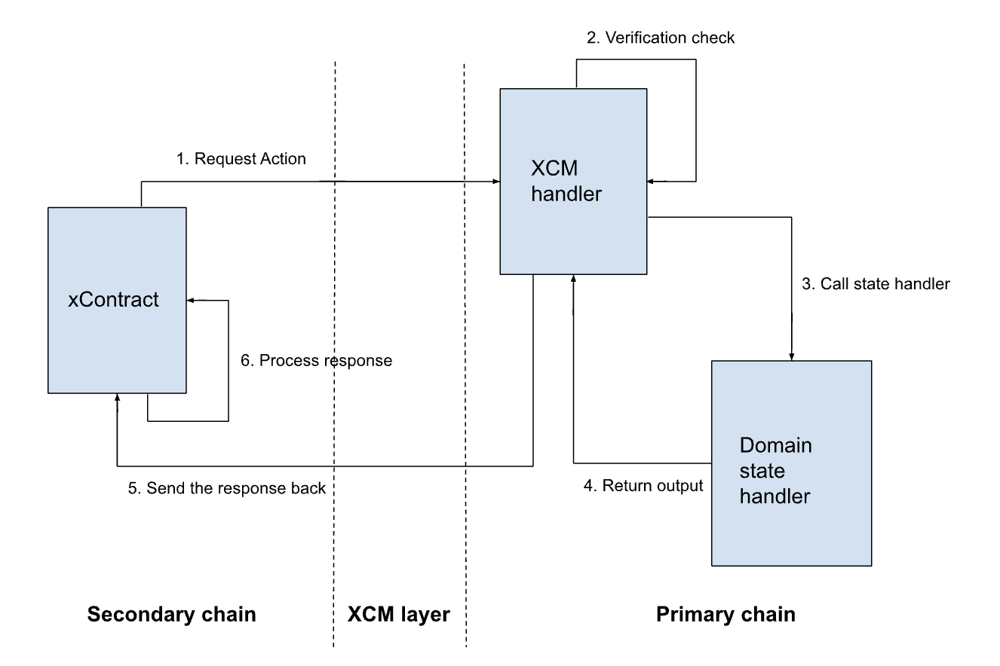

There are 3 contracts provided, namely - [domain_service](./domain_service/), [xcm_handler](./xcm_handler/), and [xc_domain_service](./xc_domain_service/) based on the below architecture design.

# Architecture

